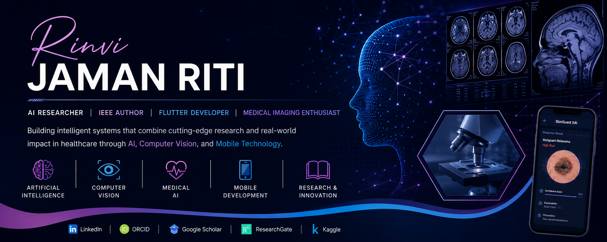

# 👋 Hi, I'm Rinvi Jaman Riti

### AI Researcher • IEEE Author • Flutter Developer • Medical Imaging Enthusiast

Final-Year Computer Science & Engineering Student at **Daffodil International University**.

Passionate about **Artificial Intelligence, Deep Learning, Computer Vision, Medical Imaging, Explainable AI (XAI),** and **Mobile Application Development**.

---

# 🚀 Current Projects

## 🩺 MobileSkinXAI

**An Explainable Cross-Domain Lightweight Deep Learning Framework for Mobile-Based Skin Cancer Screening**

> Thesis Project (In Progress)

Current research focuses on:

* Explainable AI (Grad-CAM)
* Medical Image Classification
* TensorFlow Lite Deployment
* Flutter Integration
* Mobile Healthcare AI

---

## 🤖 ResearchMate AI

AI-powered research assistant that helps researchers analyze academic papers through automated summarization, structured reporting, and literature review support.

---

# ⭐ Featured Projects

### 🩺 MobileSkinXAI

Explainable Mobile AI framework for skin cancer screening using lightweight deep learning models.

---

### 🤖 ResearchMate AI

Multi-agent AI research assistant for literature review and academic paper analysis.

---

### 🔬 SkinGuard XAI

End-to-end Explainable AI system for skin lesion classification using MobileNetV2 and Grad-CAM.

🌐 Live Demo:

https://huggingface.co/spaces/rinviriti/SkinGuard-XAI

---

### 📚 AI & Machine Learning Learning Journey

A structured collection of notebooks and projects documenting practical learning from Python fundamentals to Medical AI.

---

# 💻 Tech Stack

## Languages

---

## AI & Data Science

---

## Mobile Development

---

## Tools

---

# 📚 Publications

## IEEE ECCE 2025

🩺 **Weather Data Driven Dengue Risk Zone Prediction using Machine Learning Algorithms**

🔗 https://doi.org/10.1109/ECCE64574.2025.11013910

---

🌡️ **Predicting Heat Stroke Risk: A Clinical Decision Support System using Fuzzy Association Mining Approach**

🔗 https://doi.org/10.1109/ECCE64574.2025.11012974

---

🚦 **Traditional Art and Craft Item Recognition Using Deep Learning**

🔗 https://doi.org/10.1109/ECCE64574.2025.11013395

---

# 🔬 Research Interests

* 🩺 Medical Imaging
* 🧠 Explainable AI (XAI)
* 👁️ Computer Vision
* 🤖 Deep Learning
* 📱 Mobile Healthcare AI
* 🔬 Medical Image Analysis

---

# 📊 GitHub Statistics

---

# 📈 Contribution Activity

---

# 🌍 Portfolio

🌐 https://sites.google.com/diu.edu.bd/rinvijamanriti

---

### *"Technology becomes meaningful when it improves lives."*

